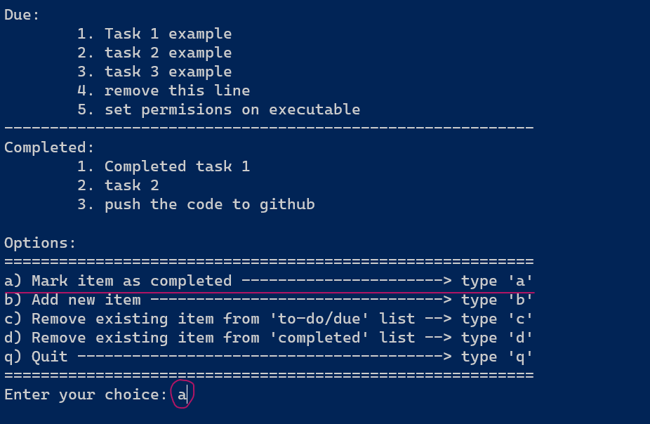
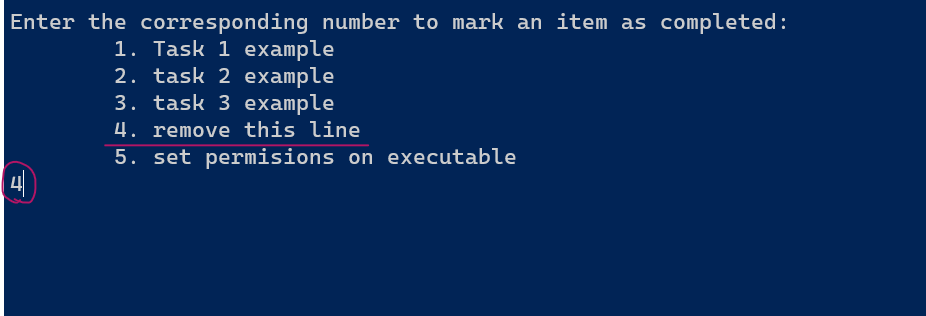
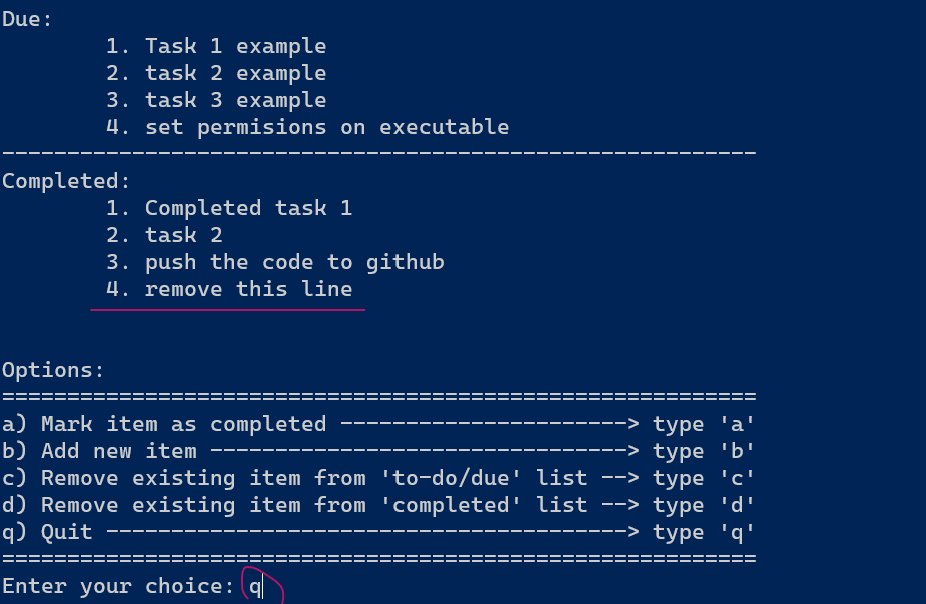
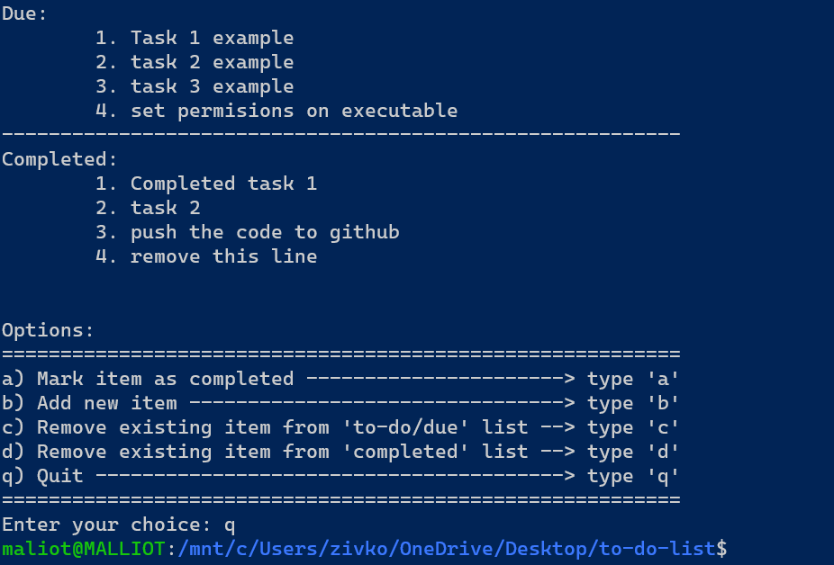

# To-Do List (terminal based)

<!-- Create a simple to-do list application using C programming language.

The application should have the following features:
- The user can add tasks to the list
- The user can view the task on the list
- The user can mark tasks as completed or remove them from the list
- The application should be terminal-based, just like your previous projects

This project is a good git for your portfolio because is a practical application that many people would find usedul. Additionally, it's not too advanced, so it should be achievable even if you're not a seasoned programmer. (the text is from chatGPT, where I got the idea from) -->

Terminal based To-Do list application made in C language. It works on both Windows and Linux. You do not have to have any prerequirements in order to run it.

The application has the following features:
- The user can add tasks to the list
- The user can view the task on the list
- The user can mark tasks as completed or remove them from the list
- The application should be terminal-based, just like your previous projects

To run the application, locate to where the exacutable/script is stored and run:
- on Windows: 
    - ./todo.exe    (or simply double-click todo.exe)
- on Linux:
    - ./todo.sh     (or simply double-click todo.sh)

You can easily add and remove items from the list. To mark item as complete, or to fulfill any other option, just type the corresponding button and press enter. (look at the demo-example below).

<b>Step 1:</b> After starting the application, select the option you want to perform by typing the corresponding letter:

<b>Step 2:</b> Type the number of the item in the list, which you want to delete.

<b>Step 3:</b> The changes are already visible. Choose another option.

<b>Step 4:</b> After chosing quit, the application ends.

